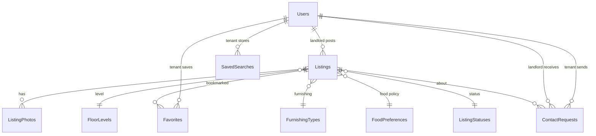

# Room Rent — Database Schema Walkthrough

## Overview

6 SQL migration files created in `d:\rohit\room-rent\database\`, designed for **Azure SQL Server (MSSQL)**.  
Run them in numeric order: `001` → `002` → `003` → `004` → `005` → `006`.

---

## ER Diagram

---

## Files & Tables

| #   | File                                                                                                                           | Tables Created                                                         |
| --- | ------------------------------------------------------------------------------------------------------------------------------ | ---------------------------------------------------------------------- |
| 001 | [001_create_lookup_tables.sql](file:///d:/rohit/room-rent/database/001_create_lookup_tables.sql)                               | `FloorLevels`, `FurnishingTypes`, `FoodPreferences`, `ListingStatuses` |
| 002 | [002_create_users.sql](file:///d:/rohit/room-rent/database/002_create_users.sql)                                               | `Users`                                                                |
| 003 | [003_create_listings.sql](file:///d:/rohit/room-rent/database/003_create_listings.sql)                                         | `Listings`                                                             |
| 004 | [004_create_photos.sql](file:///d:/rohit/room-rent/database/004_create_photos.sql)                                             | `ListingPhotos` + trigger                                              |
| 005 | [005_create_saved_searches_and_favorites.sql](file:///d:/rohit/room-rent/database/005_create_saved_searches_and_favorites.sql) | `Favorites`, `SavedSearches`, `ContactRequests`                        |
| 006 | [006_sample_queries.sql](file:///d:/rohit/room-rent/database/006_sample_queries.sql)                                           | — (query templates only)                                               |

---

## Key Design Decisions

### 1. Spatial Search — `GEOGRAPHY` Type

The Listings table stores `Latitude` and `Longitude` as `DECIMAL(9,6)` and computes a **persisted** `GEOGRAPHY` column.  
A `GEOGRAPHY_AUTO_GRID` spatial index (`SIX_Listings_Location`) powers the **"within 5 km"** search using `STDistance()`.

### 2. Lookup Tables with TINYINT PKs

Enum-like values (floor, furnishing, food, status) live in separate small tables instead of strings.

- **1-byte FK** columns → smaller indexes, faster joins
- Easy to add new values without schema changes
- Referential integrity enforced by FKs

### 3. Filtered Indexes (Active Listings Only)

The four main search indexes (`Colony`, `Rent`, `MaxOccupants`, `AvailableFrom`) are all **filtered** with `WHERE StatusId = 1`.  
Since ~80%+ of searches target active listings, this keeps the indexes small and scans fast.

### 4. Aadhaar Security

- Stored as `VARBINARY(512)` — **encrypted at the application layer** (AES-256)
- A `BINARY(32)` SHA-256 hash column (`AadhaarHash`) is indexed for uniqueness checks **without decrypting**
- Never stored as plain text anywhere

### 5. Photo Count Enforcement

A `AFTER INSERT, UPDATE` trigger on `ListingPhotos` enforces the business rule:

- Max **2** room photos
- Max **1** exterior photo

### 6. UUID Primary Keys (`NEWSEQUENTIALID`)

All entity PKs use `UNIQUEIDENTIFIER` with `NEWSEQUENTIALID()` (not `NEWID()`) to avoid random page splits in clustered indexes.

### 7. Composite INCLUDE Indexes

Every search index uses `INCLUDE` columns for the fields typically returned in listing cards, enabling **covering index** scans that avoid key lookups.

---

## Index Summary (Listings Table)

| Index                       | Search Use Case             | Type        |
| --------------------------- | --------------------------- | ----------- |
| `CIX_Listings_CreatedAt`    | Default sort (newest first) | Clustered   |
| `IX_Listings_Colony`        | Search by colony name       | Filtered NC |
| `IX_Listings_Rent`          | Search by rent range        | Filtered NC |
| `IX_Listings_MaxOccupants`  | Search by roommate count    | Filtered NC |
| `SIX_Listings_Location`     | Within 5 km radius          | Spatial     |
| `IX_Listings_LandlordId`    | Landlord dashboard          | NC          |
| `IX_Listings_AvailableFrom` | Available from date filter  | Filtered NC |

---

## Bonus Tables

Beyond your core requirements, I added three supporting tables that any production rental platform needs:

- **`Favorites`** — Tenants bookmark listings for later
- **`SavedSearches`** — Tenants save their filter combinations (colony, rent range, radius, etc.)
- **`ContactRequests`** — Tenants express interest in a listing; landlords accept/reject

> [!NOTE]
> File `006` contains **ready-to-use parameterized SQL queries** for all 4 search features plus a combined multi-filter search. Use these as the basis for your TypeScript service/repository layer.
